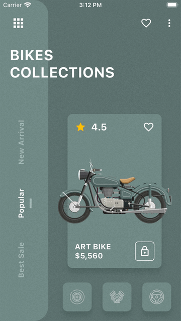

# Flutter_ArtBike_ui_challenge

This was the Flutter ArtBike UI Challenge from Instagram, and I have successfully completed it.

## Preview

It is a Flutter project, and this is what it looks like:

### Gif

A few resources to get you started if this is your first Flutter project:

- [Lab: Write your first Flutter app](https://docs.flutter.dev/get-started/codelab)
- [Cookbook: Useful Flutter samples](https://docs.flutter.dev/cookbook)

For help getting started with Flutter development, view the
[online documentation](https://docs.flutter.dev/), which offers tutorials,
samples, guidance on mobile development, and a full API reference.
